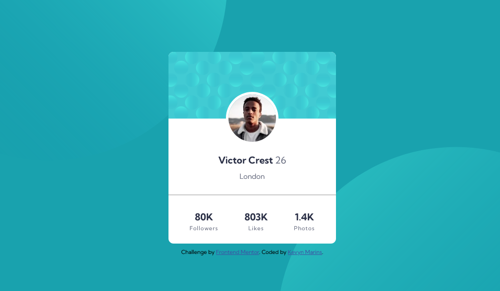

# Frontend Mentor - Profile card component solution

This is a solution to the [Profile card component challenge on Frontend Mentor](https://www.frontendmentor.io/challenges/profile-card-component-cfArpWshJ).

## Table of contents

- [Overview](#overview)
  - [The challenge](#the-challenge)
  - [Screenshot](#screenshot)
  - [Links](#links)
- [My process](#my-process)
  - [Built with](#built-with)
  - [What I learned](#what-i-learned)
  - [Continued development](#continued-development)  
- [Author](#author)

## Overview

### The challenge

- Build out the project to the designs provided

### Screenshot

### Links

- Live Site URL: [Profile card component](https://kevynsm.github.io/Profile-card-component/)

## My process

### Built with

- Semantic HTML5 markup
- CSS custom properties
- Flexbox
- Media Queries
- Mobile-first workflow

### What I learned

I used this project to practice my HTML and CSS skills, focusing mainly on Flexbox and Media Queries. 

### Continued development

I still have a lot to learning about FlexBox and Media Queries, so for my next project I'm going to keep practicing these concepts.

## Author

- Frontend Mentor - [@KevynSM](https://www.frontendmentor.io/profile/KevynSM)

